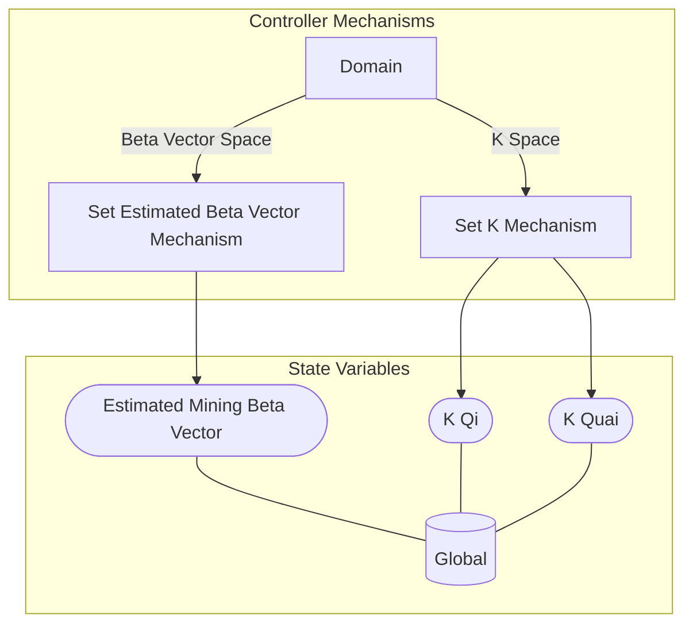

## Wiring Diagram

## Description

Block Type: Parallel Block
The wiring for mechanisms for controllers
## Components
1. [[Set K Mechanism]]
2. [[Set Estimated Beta Vector Mechanism]]

## All Blocks
1. [[Set Estimated Beta Vector Mechanism]]
2. [[Set K Mechanism]]

## Constraints

## Domain Spaces
1. [[K Space]]
2. [[Beta Vector Space]]

## Codomain Spaces
1. [[Empty Space]]

## All Spaces Used
1. [[Beta Vector Space]]
2. [[Empty Space]]
3. [[K Space]]
4. [[Terminating Space]]

## Parameters Used
1. [[Minimum K Qi]]
2. [[State Update Skipping Parameter]]

## Called By

## Calls

## All State Updates
1. [[Global]].[[Global State-Estimated Mining Beta Vector|Estimated Mining Beta Vector]]
2. [[Global]].[[Global State-K Qi|K Qi]]
3. [[Global]].[[Global State-K Quai|K Quai]]

