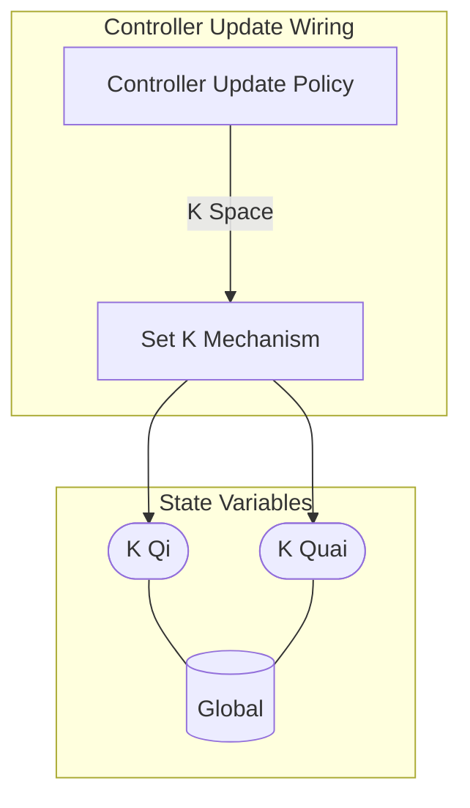

## Wiring Diagram

## Description

Block Type: Stack Block
The wiring for the controller actions
## Components
1. [[Controller Update Policy]]
2. [[Set K Mechanism]]

## All Blocks
1. [[Controller Update Policy]]
2. [[Set K Mechanism]]

## Constraints

## Domain Spaces
1. [[Observable State Space]]

## Codomain Spaces
1. [[Terminating Space]]

## All Spaces Used
1. [[K Space]]
2. [[Observable State Space]]
3. [[Terminating Space]]

## Parameters Used
1. [[Initial Block Difficulty]]
2. [[PID Parameterization]]

## Called By

## Calls

## All State Updates
1. [[Global]].[[Global State-K Qi|K Qi]]
2. [[Global]].[[Global State-K Quai|K Quai]]

