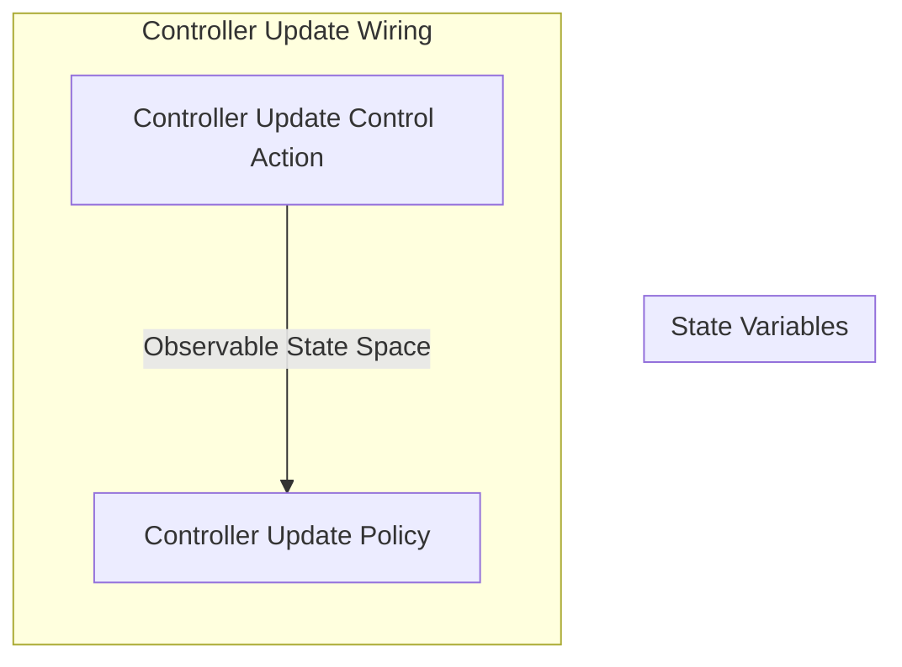

## Wiring Diagram

## Description

Block Type: Stack Block
The wiring for the controller actions
## Components
1. [[Controller Update Control Action]]
2. [[Controller Update Policy]]

## All Blocks
1. [[Controller Update Control Action]]
2. [[Controller Update Policy]]

## Constraints

## Domain Spaces

## Codomain Spaces
1. [[Empty Space]]

## All Spaces Used
1. [[Empty Space]]
2. [[Observable State Space]]

## Parameters Used

## Called By

## Calls

## All State Updates

