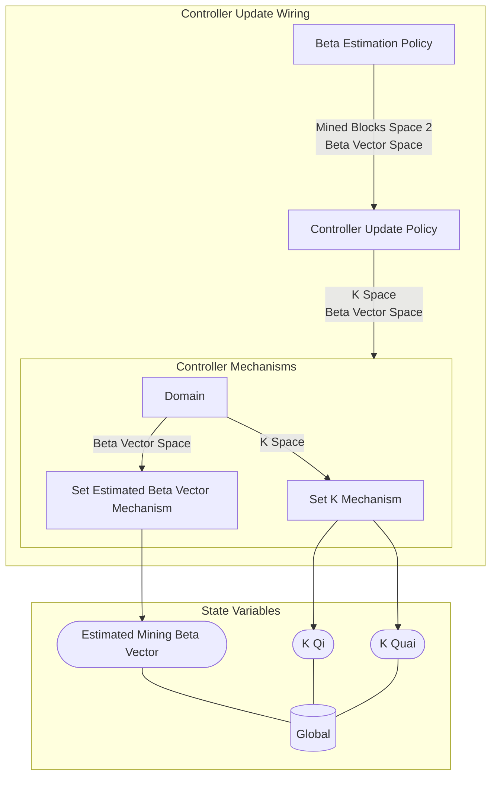

## Wiring Diagram

## Description

Block Type: Stack Block
The wiring for the controller actions
## Components
1. [[Beta Estimation Policy]]
2. [[Controller Update Policy]]
3. [[Controller Mechanisms]]

## All Blocks
1. [[Beta Estimation Policy]]
2. [[Controller Update Policy]]
3. [[Set Estimated Beta Vector Mechanism]]
4. [[Set K Mechanism]]

## Constraints

## Domain Spaces
1. [[Mined Blocks Space 2]]

## Codomain Spaces
1. [[Empty Space]]

## All Spaces Used
1. [[Beta Vector Space]]
2. [[Empty Space]]
3. [[K Space]]
4. [[Mined Blocks Space 2]]
5. [[Terminating Space]]

## Parameters Used
1. [[Controller Alpha Parameter]]
2. [[Initial Block Difficulty]]
3. [[PID Parameterization]]
4. [[State Update Skipping Parameter]]

## Called By

## Calls

## All State Updates
1. [[Global]].[[Global State-Estimated Mining Beta Vector|Estimated Mining Beta Vector]]
2. [[Global]].[[Global State-K Qi|K Qi]]
3. [[Global]].[[Global State-K Quai|K Quai]]

