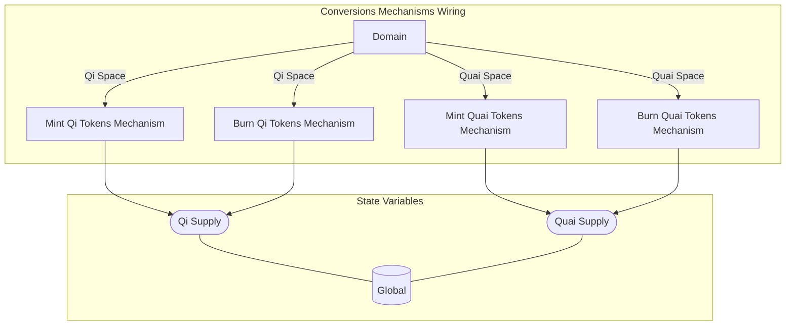

## Wiring Diagram

## Description

Block Type: Parallel Block

## Components
1. [[Mint Qi Tokens Mechanism]]
2. [[Mint Quai Tokens Mechanism]]
3. [[Burn Qi Tokens Mechanism]]
4. [[Burn Quai Tokens Mechanism]]

## All Blocks
1. [[Burn Qi Tokens Mechanism]]
2. [[Burn Quai Tokens Mechanism]]
3. [[Mint Qi Tokens Mechanism]]
4. [[Mint Quai Tokens Mechanism]]

## Constraints

## Domain Spaces
1. [[Qi Space]]
2. [[Quai Space]]
3. [[Qi Space]]
4. [[Quai Space]]

## Codomain Spaces
1. [[Empty Space]]

## All Spaces Used
1. [[Empty Space]]
2. [[Qi Space]]
3. [[Quai Space]]
4. [[Terminating Space]]

## Parameters Used

## Called By

## Calls

## All State Updates
1. [[Global]].[[Global State-Qi Supply|Qi Supply]]
2. [[Global]].[[Global State-Quai Supply|Quai Supply]]

