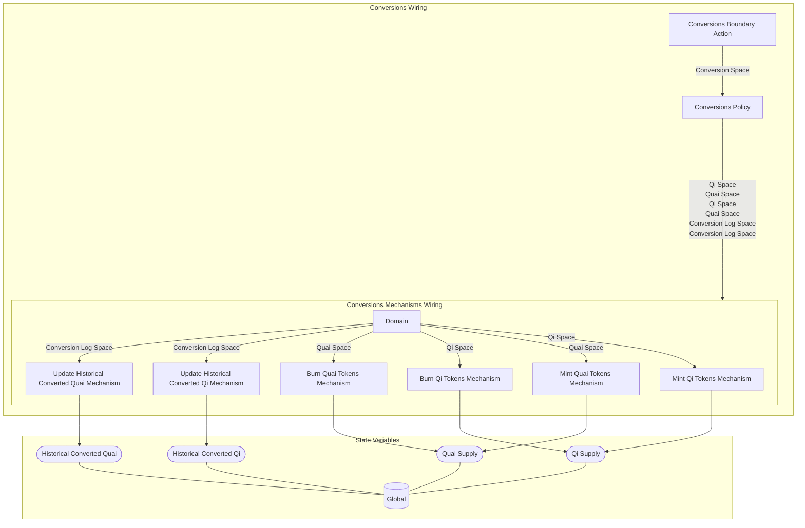

## Wiring Diagram

## Description

Block Type: Stack Block
While the [[Mining Payment Policy|election to receive block rewards in Quai or Qi is reserved for miners]], the ability to [[Conversions Wiring|convert Qi and Quai tokens is embedded natively in the protocol]], and is available to any [[Network Participant]] to utilize at any time. The conversion ratio is defined by the ratio of the [[Current Block Reward Ratio Metric|current block reward of both Quai and Qi]].

For example, if the current Quai block reward is 1 and the current Qi block reward is 2, any [[Network Participant]] would be able to [[Burn Qi Tokens Mechanism|burn Qi tokens]] to [[Mint Quai Tokens Mechanism|mint new Quai tokens]] at a rate of 2:1.

This mechanism allows for greater responsiveness in the [[Qi Supply Metric|supply of Qi]], allowing all [[Network Participant|network participants]], not just [[Miner|miners]], to participate in the ongoing [[Trade Tokens Wiring|arbitrage]] between [[Qi Demand]] and [[Qi Supply Metric|Qi supply]].
## Components
1. [[Conversions Boundary Action]]
2. [[Conversions Policy]]
3. [[Conversions Mechanisms Wiring]]

## All Blocks
1. [[Burn Qi Tokens Mechanism]]
2. [[Burn Quai Tokens Mechanism]]
3. [[Conversions Boundary Action]]
4. [[Conversions Policy]]
5. [[Mint Qi Tokens Mechanism]]
6. [[Mint Quai Tokens Mechanism]]
7. [[Update Historical Converted Qi Mechanism]]
8. [[Update Historical Converted Quai Mechanism]]

## Constraints

## Domain Spaces

## Codomain Spaces
1. [[Empty Space]]

## All Spaces Used
1. [[Conversion Log Space]]
2. [[Conversion Space]]
3. [[Empty Space]]
4. [[Qi Space]]
5. [[Quai Space]]
6. [[Terminating Space]]

## Parameters Used
1. [[Minimum Qi Conversion Amount]]
2. [[Minimum Quai Conversion Amount]]

## Called By

## Calls

## All State Updates
1. [[Global]].[[Global State-Historical Converted Qi|Historical Converted Qi]]
2. [[Global]].[[Global State-Historical Converted Quai|Historical Converted Quai]]
3. [[Global]].[[Global State-Qi Supply|Qi Supply]]
4. [[Global]].[[Global State-Quai Supply|Quai Supply]]

