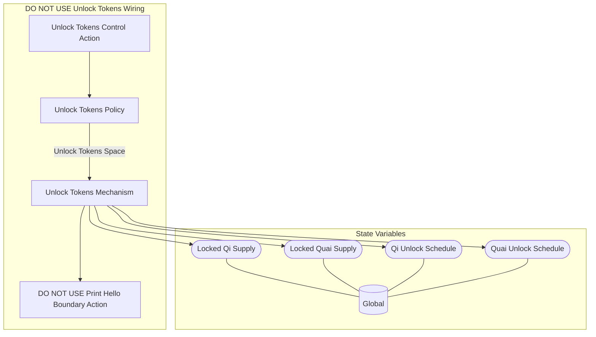

## Wiring Diagram

## Description

Block Type: Stack Block
The wiring for movements on the price of Qi and Quai
## Components
1. [[Unlock Tokens Control Action]]
2. [[Unlock Tokens Policy]]
3. [[Unlock Tokens Mechanism]]
4. [[DO NOT USE Print Hello Boundary Action]]

## All Blocks
1. [[DO NOT USE Print Hello Boundary Action]]
2. [[Unlock Tokens Control Action]]
3. [[Unlock Tokens Mechanism]]
4. [[Unlock Tokens Policy]]

## Constraints

## Domain Spaces
1. [[Empty Space]]

## Codomain Spaces
1. [[Empty Space]]

## All Spaces Used
1. [[Empty Space]]
2. [[Terminating Space]]
3. [[Unlock Tokens Space]]

## Parameters Used

## Called By

## Calls

## All State Updates
1. [[Global]].[[Global State-Locked Qi Supply|Locked Qi Supply]]
2. [[Global]].[[Global State-Locked Quai Supply|Locked Quai Supply]]
3. [[Global]].[[Global State-Qi Unlock Schedule|Qi Unlock Schedule]]
4. [[Global]].[[Global State-Quai Unlock Schedule|Quai Unlock Schedule]]

