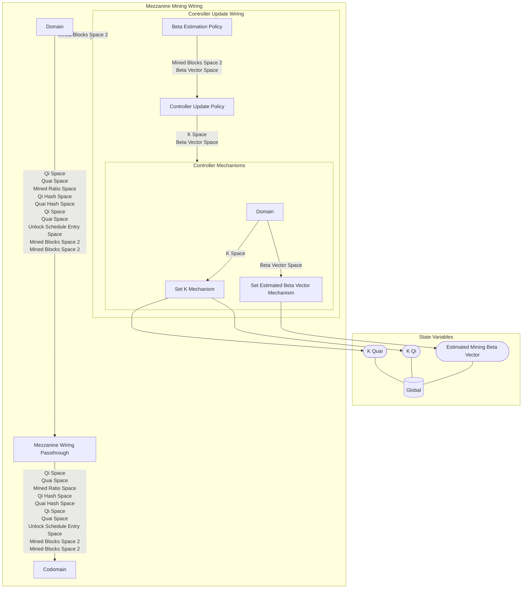

## Wiring Diagram

## Description

Block Type: Parallel Block
Passes through most of the spaces except for the ones needed for updating the controller
## Components
1. [[Controller Update Wiring]]
2. [[Mezzanine Wiring Passthrough]]

## All Blocks
1. [[Beta Estimation Policy]]
2. [[Controller Update Policy]]
3. [[Mezzanine Wiring Passthrough]]
4. [[Set Estimated Beta Vector Mechanism]]
5. [[Set K Mechanism]]

## Constraints

## Domain Spaces
1. [[Mined Blocks Space 2]]
2. [[Qi Space]]
3. [[Quai Space]]
4. [[Mined Ratio Space]]
5. [[Qi Hash Space]]
6. [[Quai Hash Space]]
7. [[Qi Space]]
8. [[Quai Space]]
9. [[Unlock Schedule Entry Space]]
10. [[Mined Blocks Space 2]]
11. [[Mined Blocks Space 2]]

## Codomain Spaces
1. [[Qi Space]]
2. [[Quai Space]]
3. [[Mined Ratio Space]]
4. [[Qi Hash Space]]
5. [[Quai Hash Space]]
6. [[Qi Space]]
7. [[Quai Space]]
8. [[Unlock Schedule Entry Space]]
9. [[Mined Blocks Space 2]]
10. [[Mined Blocks Space 2]]

## All Spaces Used
1. [[Beta Vector Space]]
2. [[Empty Space]]
3. [[K Space]]
4. [[Mined Blocks Space 2]]
5. [[Mined Ratio Space]]
6. [[Qi Hash Space]]
7. [[Qi Space]]
8. [[Quai Hash Space]]
9. [[Quai Space]]
10. [[Terminating Space]]
11. [[Unlock Schedule Entry Space]]

## Parameters Used
1. [[Controller Alpha Parameter]]
2. [[Initial Block Difficulty]]
3. [[PID Parameterization]]

## Called By

## Calls

## All State Updates
1. [[Global]].[[Global State-Estimated Mining Beta Vector|Estimated Mining Beta Vector]]
2. [[Global]].[[Global State-K Qi|K Qi]]
3. [[Global]].[[Global State-K Quai|K Quai]]

