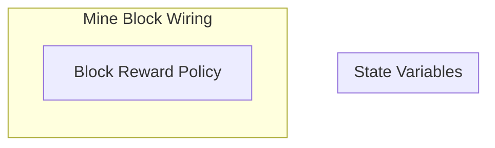

## Wiring Diagram

## Description

Block Type: Stack Block
The wiring for mining a block
## Components
1. [[Block Reward Policy]]

## All Blocks
1. [[Block Reward Policy]]

## Constraints

## Domain Spaces
1. [[Empty Space]]

## Codomain Spaces
1. [[Block Reward Options Space]]

## All Spaces Used
1. [[Block Reward Options Space]]
2. [[Empty Space]]

## Parameters Used

## Called By

## Calls

## All State Updates

