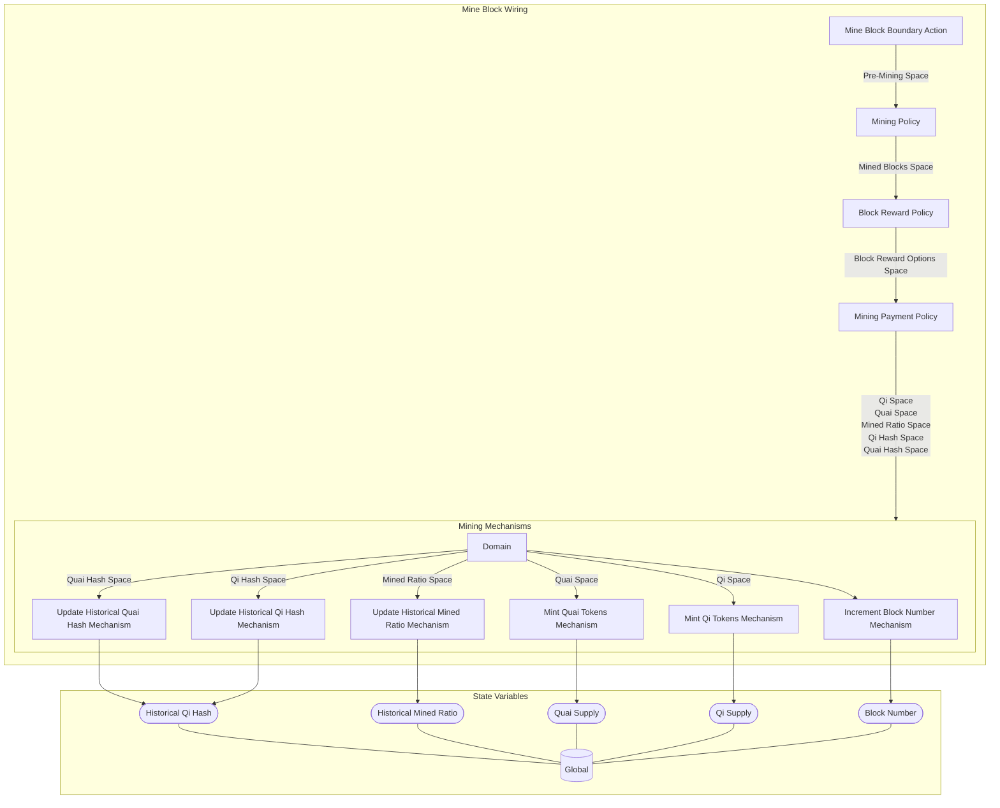

## Wiring Diagram

## Description

Block Type: Stack Block
The wiring for mining a block
## Components
1. [[Mine Block Boundary Action]]
2. [[Mining Policy]]
3. [[Block Reward Policy]]
4. [[Mining Payment Policy]]
5. [[Mining Mechanisms]]

## All Blocks
1. [[Block Reward Policy]]
2. [[Increment Block Number Mechanism]]
3. [[Mine Block Boundary Action]]
4. [[Mining Payment Policy]]
5. [[Mining Policy]]
6. [[Mint Qi Tokens Mechanism]]
7. [[Mint Quai Tokens Mechanism]]
8. [[Update Historical Mined Ratio Mechanism]]
9. [[Update Historical Qi Hash Mechanism]]
10. [[Update Historical Quai Hash Mechanism]]

## Constraints

## Domain Spaces
1. [[Empty Space]]

## Codomain Spaces
1. [[Empty Space]]

## All Spaces Used
1. [[Block Reward Options Space]]
2. [[Empty Space]]
3. [[Mined Blocks Space]]
4. [[Mined Ratio Space]]
5. [[Pre-Mining Space]]
6. [[Qi Hash Space]]
7. [[Qi Space]]
8. [[Quai Hash Space]]
9. [[Quai Space]]
10. [[Terminating Space]]

## Parameters Used
1. [[Quai Reward Base Parameter]]

## Called By

## Calls

## All State Updates
1. [[Global]].[[Global State-Block Number|Block Number]]
2. [[Global]].[[Global State-Historical Mined Ratio|Historical Mined Ratio]]
3. [[Global]].[[Global State-Historical Qi Hash|Historical Qi Hash]]
4. [[Global]].[[Global State-Qi Supply|Qi Supply]]
5. [[Global]].[[Global State-Quai Supply|Quai Supply]]

