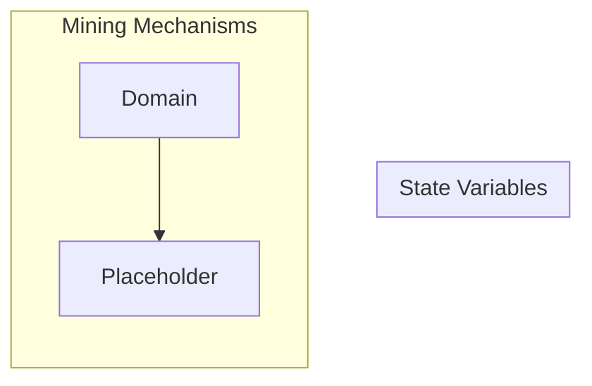

## Wiring Diagram

## Description

Block Type: Parallel Block
The mechanisms associated with mining a block
## Components
1. [[Placeholder]]

## All Blocks
1. [[Placeholder]]

## Constraints

## Domain Spaces
1. [[Empty Space]]

## Codomain Spaces
1. [[Empty Space]]

## All Spaces Used
1. [[Empty Space]]

## Parameters Used

## Called By

## Calls

## All State Updates

