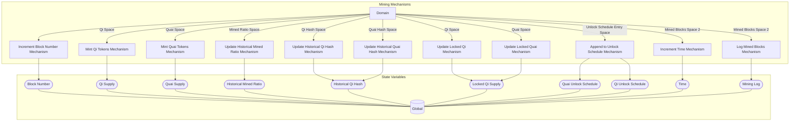

## Wiring Diagram

## Description

Block Type: Parallel Block
The mechanisms associated with mining a block
## Components
1. [[Increment Block Number Mechanism]]
2. [[Mint Qi Tokens Mechanism]]
3. [[Mint Quai Tokens Mechanism]]
4. [[Update Historical Mined Ratio Mechanism]]
5. [[Update Historical Qi Hash Mechanism]]
6. [[Update Historical Quai Hash Mechanism]]
7. [[Update Locked Qi Mechanism]]
8. [[Update Locked Quai Mechanism]]
9. [[Append to Unlock Schedule Mechanism]]
10. [[Increment Time Mechanism]]
11. [[Log Mined Blocks Mechanism]]

## All Blocks
1. [[Append to Unlock Schedule Mechanism]]
2. [[Increment Block Number Mechanism]]
3. [[Increment Time Mechanism]]
4. [[Log Mined Blocks Mechanism]]
5. [[Mint Qi Tokens Mechanism]]
6. [[Mint Quai Tokens Mechanism]]
7. [[Update Historical Mined Ratio Mechanism]]
8. [[Update Historical Qi Hash Mechanism]]
9. [[Update Historical Quai Hash Mechanism]]
10. [[Update Locked Qi Mechanism]]
11. [[Update Locked Quai Mechanism]]

## Constraints

## Domain Spaces
1. [[Qi Space]]
2. [[Quai Space]]
3. [[Mined Ratio Space]]
4. [[Qi Hash Space]]
5. [[Quai Hash Space]]
6. [[Qi Space]]
7. [[Quai Space]]
8. [[Unlock Schedule Entry Space]]
9. [[Mined Blocks Space 2]]
10. [[Mined Blocks Space 2]]

## Codomain Spaces
1. [[Empty Space]]

## All Spaces Used
1. [[Empty Space]]
2. [[Mined Blocks Space 2]]
3. [[Mined Ratio Space]]
4. [[Qi Hash Space]]
5. [[Qi Space]]
6. [[Quai Hash Space]]
7. [[Quai Space]]
8. [[Terminating Space]]
9. [[Unlock Schedule Entry Space]]

## Parameters Used

## Called By

## Calls

## All State Updates
1. [[Global]].[[Global State-Block Number|Block Number]]
2. [[Global]].[[Global State-Historical Mined Ratio|Historical Mined Ratio]]
3. [[Global]].[[Global State-Historical Qi Hash|Historical Qi Hash]]
4. [[Global]].[[Global State-Locked Qi Supply|Locked Qi Supply]]
5. [[Global]].[[Global State-Mining Log|Mining Log]]
6. [[Global]].[[Global State-Qi Supply|Qi Supply]]
7. [[Global]].[[Global State-Qi Unlock Schedule|Qi Unlock Schedule]]
8. [[Global]].[[Global State-Quai Supply|Quai Supply]]
9. [[Global]].[[Global State-Quai Unlock Schedule|Quai Unlock Schedule]]
10. [[Global]].[[Global State-Time|Time]]

