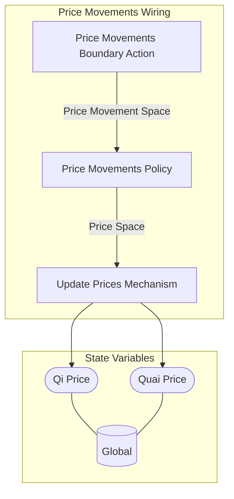

## Wiring Diagram

## Description

Block Type: Stack Block
The wiring for movements on the price of Qi and Quai
## Components
1. [[Price Movements Boundary Action]]
2. [[Price Movements Policy]]
3. [[Update Prices Mechanism]]

## All Blocks
1. [[Price Movements Boundary Action]]
2. [[Price Movements Policy]]
3. [[Update Prices Mechanism]]

## Constraints

## Domain Spaces
1. [[Empty Space]]

## Codomain Spaces
1. [[Terminating Space]]

## All Spaces Used
1. [[Empty Space]]
2. [[Price Movement Space]]
3. [[Price Space]]
4. [[Terminating Space]]

## Parameters Used
1. [[Asset Return Parameterization]]
2. [[Hashpower Cost Series]]
3. [[Price EWMA Lambda]]
4. [[Qi Price Movemement Sigma]]
5. [[Quai Price Movemement Sigma]]

## Called By

## Calls

## All State Updates
1. [[Global]].[[Global State-Qi Price|Qi Price]]
2. [[Global]].[[Global State-Quai Price|Quai Price]]

