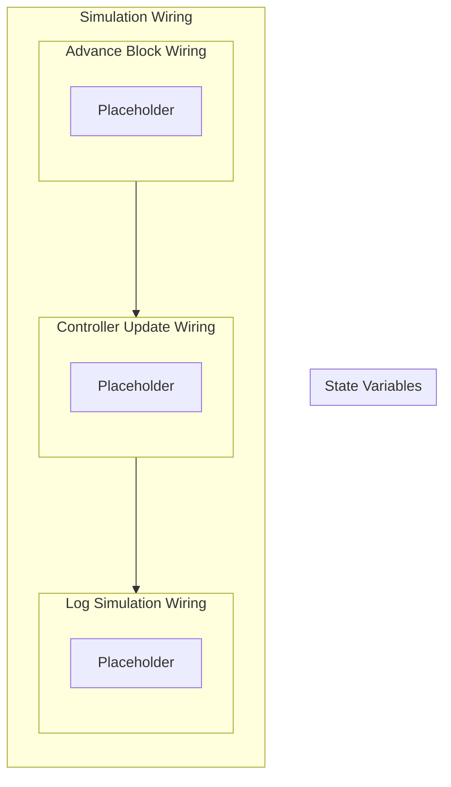

## Wiring Diagram

## Description

Block Type: Stack Block
The wiring of the entire simulation
## Components
1. [[Advance Block Wiring]]
2. [[Controller Update Wiring]]
3. [[Log Simulation Wiring]]

## All Blocks
1. [[Placeholder]]

## Constraints

## Domain Spaces

## Codomain Spaces
1. [[Empty Space]]

## All Spaces Used
1. [[Empty Space]]

## Parameters Used

## Called By

## Calls

## All State Updates

