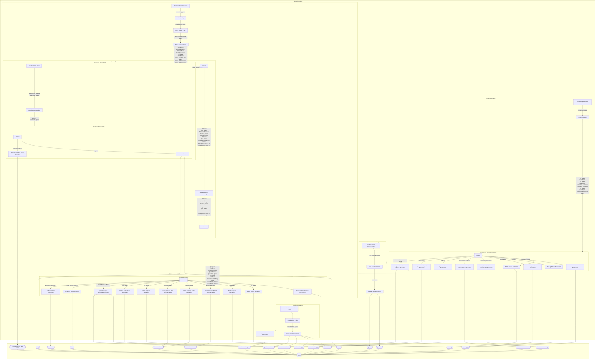

## Wiring Diagram

## Description

Block Type: Stack Block
The wiring of the entire simulation
## Components
1. [[Price Movements Wiring]]
2. [[Conversions Wiring]]
3. [[Mine Block Wiring]]
4. [[Unlock Tokens Wiring]]
5. [[Log Simulation Data Mechanism]]

## All Blocks
1. [[Append to Unlock Schedule Mechanism]]
2. [[Beta Estimation Policy]]
3. [[Block Reward Policy]]
4. [[Burn Qi Tokens Mechanism]]
5. [[Burn Quai Tokens Mechanism]]
6. [[Controller Update Policy]]
7. [[Conversions Boundary Action]]
8. [[Conversions Policy]]
9. [[Increment Block Number Mechanism]]
10. [[Increment Time Mechanism]]
11. [[Log Mined Blocks Mechanism]]
12. [[Log Simulation Data Mechanism]]
13. [[Mezzanine Wiring Passthrough]]
14. [[Mine Block Boundary Action]]
15. [[Mining Payment Policy]]
16. [[Mining Policy]]
17. [[Mint Qi Tokens Mechanism]]
18. [[Mint Quai Tokens Mechanism]]
19. [[Price Movements Boundary Action]]
20. [[Price Movements Policy]]
21. [[Set Estimated Beta Vector Mechanism]]
22. [[Set K Mechanism]]
23. [[Unlock Tokens Control Action]]
24. [[Unlock Tokens Mechanism]]
25. [[Unlock Tokens Policy]]
26. [[Update Historical Converted Qi Mechanism]]
27. [[Update Historical Converted Quai Mechanism]]
28. [[Update Historical Mined Ratio Mechanism]]
29. [[Update Historical Qi Hash Mechanism]]
30. [[Update Historical Quai Hash Mechanism]]
31. [[Update Locked Qi Mechanism]]
32. [[Update Locked Quai Mechanism]]
33. [[Update Prices Mechanism]]

## Constraints

## Domain Spaces
1. [[Empty Space]]

## Codomain Spaces
1. [[Terminating Space]]

## All Spaces Used
1. [[Beta Vector Space]]
2. [[Block Reward Options Space]]
3. [[Conversion Log Space]]
4. [[Conversion Space]]
5. [[Empty Space]]
6. [[K Space]]
7. [[Mined Blocks Space]]
8. [[Mined Blocks Space 2]]
9. [[Mined Ratio Space]]
10. [[Pre-Mining Space]]
11. [[Price Movement Space]]
12. [[Price Space]]
13. [[Qi Hash Space]]
14. [[Qi Space]]
15. [[Quai Hash Space]]
16. [[Quai Space]]
17. [[Terminating Space]]
18. [[Unlock Schedule Entry Space]]
19. [[Unlock Tokens Space]]

## Parameters Used
1. [[Aggregate Hashpower Series]]
2. [[Asset Return Parameterization]]
3. [[Controller Alpha Parameter]]
4. [[Conversion Percentage Mu]]
5. [[Conversion Percentage Sigma]]
6. [[Difficulty Randomness Mu]]
7. [[Difficulty Randomness Sigma]]
8. [[Hashpower Cost Series]]
9. [[Initial Block Difficulty]]
10. [[Lockup Options]]
11. [[Minimum Qi Conversion Amount]]
12. [[Minimum Quai Conversion Amount]]
13. [[PID Parameterization]]
14. [[Price EWMA Lambda]]
15. [[Qi Price Movemement Sigma]]
16. [[Quai Price Movemement Sigma]]
17. [[Quai Reward Base Parameter]]
18. [[Speculator Percentage]]

## Called By

## Calls

## All State Updates
1. [[Global]].[[Global State-Block Number|Block Number]]
2. [[Global]].[[Global State-Estimated Mining Beta Vector|Estimated Mining Beta Vector]]
3. [[Global]].[[Global State-Historical Converted Qi|Historical Converted Qi]]
4. [[Global]].[[Global State-Historical Converted Quai|Historical Converted Quai]]
5. [[Global]].[[Global State-Historical Mined Ratio|Historical Mined Ratio]]
6. [[Global]].[[Global State-Historical Qi Hash|Historical Qi Hash]]
7. [[Global]].[[Global State-K Qi|K Qi]]
8. [[Global]].[[Global State-K Quai|K Quai]]
9. [[Global]].[[Global State-Locked Qi Supply|Locked Qi Supply]]
10. [[Global]].[[Global State-Locked Quai Supply|Locked Quai Supply]]
11. [[Global]].[[Global State-Mining Log|Mining Log]]
12. [[Global]].[[Global State-Qi Price|Qi Price]]
13. [[Global]].[[Global State-Qi Supply|Qi Supply]]
14. [[Global]].[[Global State-Qi Unlock Schedule|Qi Unlock Schedule]]
15. [[Global]].[[Global State-Quai Price|Quai Price]]
16. [[Global]].[[Global State-Quai Supply|Quai Supply]]
17. [[Global]].[[Global State-Quai Unlock Schedule|Quai Unlock Schedule]]
18. [[Global]].[[Global State-Simulation History Log|Simulation History Log]]
19. [[Global]].[[Global State-Time|Time]]

