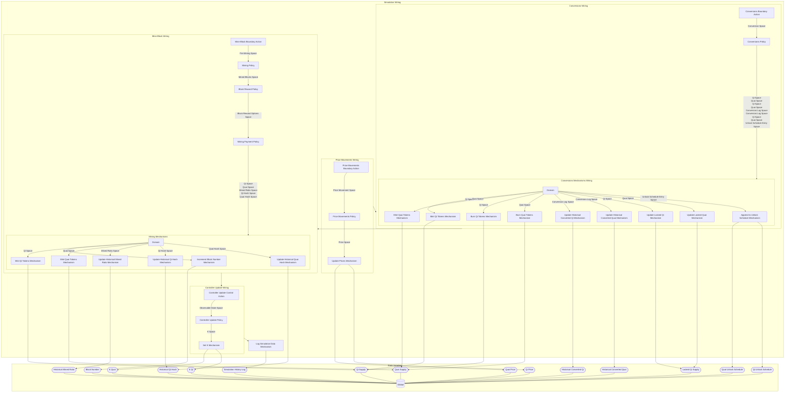

## Wiring Diagram

## Description

Block Type: Stack Block
The wiring of the entire simulation
## Components
1. [[Price Movements Wiring]]
2. [[Conversions Wiring]]
3. [[Mine Block Wiring]]
4. [[Controller Update Wiring]]
5. [[Log Simulation Data Mechanism]]

## All Blocks
1. [[Append to Unlock Schedule Mechanism]]
2. [[Block Reward Policy]]
3. [[Burn Qi Tokens Mechanism]]
4. [[Burn Quai Tokens Mechanism]]
5. [[Controller Update Control Action]]
6. [[Controller Update Policy]]
7. [[Conversions Boundary Action]]
8. [[Conversions Policy]]
9. [[Increment Block Number Mechanism]]
10. [[Log Simulation Data Mechanism]]
11. [[Mine Block Boundary Action]]
12. [[Mining Payment Policy]]
13. [[Mining Policy]]
14. [[Mint Qi Tokens Mechanism]]
15. [[Mint Quai Tokens Mechanism]]
16. [[Price Movements Boundary Action]]
17. [[Price Movements Policy]]
18. [[Set K Mechanism]]
19. [[Update Historical Converted Qi Mechanism]]
20. [[Update Historical Converted Quai Mechanism]]
21. [[Update Historical Mined Ratio Mechanism]]
22. [[Update Historical Qi Hash Mechanism]]
23. [[Update Historical Quai Hash Mechanism]]
24. [[Update Locked Qi Mechanism]]
25. [[Update Locked Quai Mechanism]]
26. [[Update Prices Mechanism]]

## Constraints

## Domain Spaces
1. [[Empty Space]]

## Codomain Spaces
1. [[Terminating Space]]

## All Spaces Used
1. [[Block Reward Options Space]]
2. [[Conversion Log Space]]
3. [[Conversion Space]]
4. [[Empty Space]]
5. [[K Space]]
6. [[Mined Blocks Space]]
7. [[Mined Ratio Space]]
8. [[Observable State Space]]
9. [[Pre-Mining Space]]
10. [[Price Movement Space]]
11. [[Price Space]]
12. [[Qi Hash Space]]
13. [[Qi Space]]
14. [[Quai Hash Space]]
15. [[Quai Space]]
16. [[Terminating Space]]
17. [[Unlock Schedule Entry Space]]

## Parameters Used
1. [[Aggregate Hashpower Series]]
2. [[Asset Return Parameterization]]
3. [[Conversion Percentage Mu]]
4. [[Conversion Percentage Sigma]]
5. [[Hashpower Cost Series]]
6. [[Initial Block Difficulty]]
7. [[Lockup Options]]
8. [[Minimum Qi Conversion Amount]]
9. [[Minimum Quai Conversion Amount]]
10. [[PID Parameterization]]
11. [[Price EWMA Lambda]]
12. [[Qi Price Movemement Sigma]]
13. [[Quai Price Movemement Sigma]]
14. [[Quai Reward Base Parameter]]
15. [[Speculator Percentage]]

## Called By

## Calls

## All State Updates
1. [[Global]].[[Global State-Block Number|Block Number]]
2. [[Global]].[[Global State-Historical Converted Qi|Historical Converted Qi]]
3. [[Global]].[[Global State-Historical Converted Quai|Historical Converted Quai]]
4. [[Global]].[[Global State-Historical Mined Ratio|Historical Mined Ratio]]
5. [[Global]].[[Global State-Historical Qi Hash|Historical Qi Hash]]
6. [[Global]].[[Global State-K Qi|K Qi]]
7. [[Global]].[[Global State-K Quai|K Quai]]
8. [[Global]].[[Global State-Locked Qi Supply|Locked Qi Supply]]
9. [[Global]].[[Global State-Qi Price|Qi Price]]
10. [[Global]].[[Global State-Qi Supply|Qi Supply]]
11. [[Global]].[[Global State-Qi Unlock Schedule|Qi Unlock Schedule]]
12. [[Global]].[[Global State-Quai Price|Quai Price]]
13. [[Global]].[[Global State-Quai Supply|Quai Supply]]
14. [[Global]].[[Global State-Quai Unlock Schedule|Quai Unlock Schedule]]
15. [[Global]].[[Global State-Simulation History Log|Simulation History Log]]

