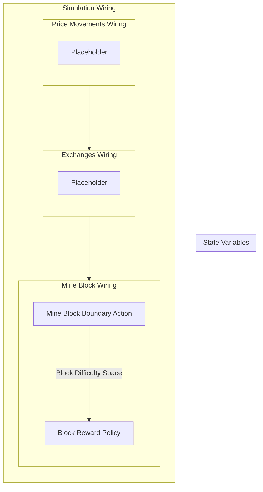

## Wiring Diagram

## Description

Block Type: Stack Block
The wiring of the entire simulation
## Components
1. [[Price Movements Wiring]]
2. [[Exchanges Wiring]]
3. [[Mine Block Wiring]]

## All Blocks
1. [[Block Reward Policy]]
2. [[Mine Block Boundary Action]]
3. [[Placeholder]]

## Constraints

## Domain Spaces

## Codomain Spaces
1. [[Block Reward Options Space]]

## All Spaces Used
1. [[Block Difficulty Space]]
2. [[Block Reward Options Space]]
3. [[Empty Space]]

## Parameters Used

## Called By

## Calls

## All State Updates

