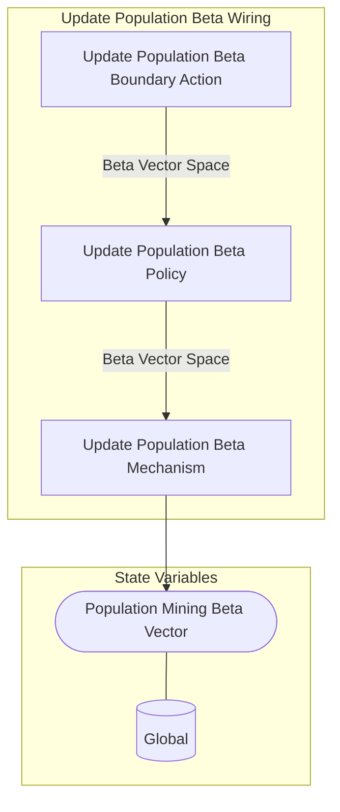

## Wiring Diagram

## Description

Block Type: Stack Block
The wiring for taking care of beta updates
## Components
1. [[Update Population Beta Boundary Action]]
2. [[Update Population Beta Policy]]
3. [[Update Population Beta Mechanism]]

## All Blocks
1. [[Update Population Beta Boundary Action]]
2. [[Update Population Beta Mechanism]]
3. [[Update Population Beta Policy]]

## Constraints

## Domain Spaces
1. [[Empty Space]]

## Codomain Spaces
1. [[Terminating Space]]

## All Spaces Used
1. [[Beta Vector Space]]
2. [[Empty Space]]
3. [[Terminating Space]]

## Parameters Used
1. [[Population Beta Signal]]

## Called By

## Calls

## All State Updates
1. [[Global]].[[Global State-Population Mining Beta Vector|Population Mining Beta Vector]]

