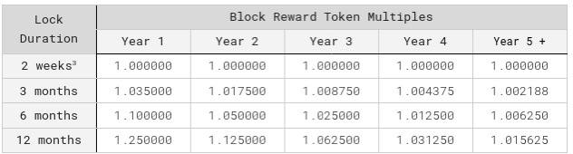

# 8/16/2024 Dev Update

## Summary

- Progress has been made on finalizing the simulation apparatus, albeit we still need to finish the controller submodule before we can have the full simulation architecture. 
- There are 62 issues open in the github repo and 95 issues closed, but most of the 62 have been talked through and have a gameplan so the progress is actually further than 95 / (62 + 95), and not all issues are created the same anyways
- There are a lot of work in progress pieces but these will all come together in the very near future
- I will walk through all the high level updates and then we can spend time on any of the following:
    - More detailed walk-throughs of the current progress
    - Working through outstanding questions
    - Any discussion topics that are brought up

## Simulation Architecture V2

- The high level simulation architecture is mostly finalized with a few open questions, left to be addressed in the oustanding questions section
- As a reminder, these pieces can all be viewed in the Obsidian vault for documentation purposes but also are having code written to be bound to them for testing
- I will now to pan over to the Obsidian canvas to go through the current planned blocks for the simulation

## High Level Status Update - Implementations and Spec

1. Metrics (MSML component meaning the modularized functions taking state, parameters, and some input and mapping out values to be used across components): Most of the metrics are complete in both the specification as well as implemented in code bound to the specification
    - Quai/Qi reward rates are complete in spec and implementation
        - One outsanding issue is to remove the parameter that allowed for modifying $log_n(Difficulty)$ with hard coding to 2 (unless there is any possibility of wanting to have this as modular)
    - Conversion rate is implemented in code and spec
    - Loss function and controller metrics to be implemented soon
2. Prices Wiring: Currently completely done in the spec, and waiting implementation (but it is a very easy implementation) pending open question on whether or not we want/need external market prices
3. Conversions: V1 of spec and implementations done
    - The boundary action have an outstanding issue to determine the behavioral model of conversions and conversion size, currently there are just two test implementations for testing Quai/Qi conversions
    - Unlocking/locking still needs to be taken into account

## Current Implementation Notebooks

## Outstanding Questions + Considerations

### Initial Allocation Vesting

1. Prefer to not include in this version of the model, but if we do need it, what impacts would we expect from the unvesting over time besides the obvious accounting updates? Does it impact prices?

### USD Prices

1. Do we have any feelings on whether or not we think USD prices are necessary?
    - They could be used an input into the behavioral model of aggregate hashpower where higher USD valuation correlates to more hashpower
    - But there might also be a case to cut from current version of the model

### Unlocking/Locking

1. How important is locking/unlocking here on macroeconomics? Hypothetically could be a place to cut for first version of the model but it sounds like we want it represented.
2. In the following table, is the miner and converter in both cases offered these 4 options of locking and they choose whatever suits them?

