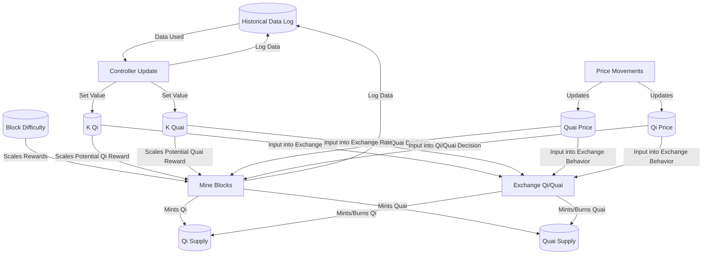

```mermaid
graph TB


S1[("Historical Data Log")]
S2[("Qi Supply")]
S3[("Quai Supply")]
S4[("Block Difficulty")]
S5[("K Qi")]
S6[("K Quai")]
S7[("Quai Price")]
S8[("Qi Price")]

A1["Price Movements"]
A2["Mine Blocks"]
A3["Exchange Qi/Quai"]
A4["Controller Update"]

A1 --Updates--> S7
A1 --Updates--> S8
S4 --Scales Rewards--> A2
S5 --Scales Potential Qi Reward-->A2
S6 --Scales Potential Quai Reward-->A2
S7 --Input into Qi/Quai Decision-->A2
S8 --Input into Qi/Quai Decision-->A2
A2 --Mints Qi-->S2
A2 --Mints Quai-->S3
A2 --Log Data-->S1
S5 --Input into Exchange Rate-->A3
S6 --Input into Exchange Rate-->A3
S7 --Input into Exchange Behavior-->A3
S8 --Input into Exchange Behavior-->A3
A3 --Mints/Burns Qi-->S2
A3 --Mints/Burns Quai-->S3
A4 --Log Data-->S1
S1 --Data Used-->A4
A4 --Set Value-->S5
A4 --Set Value-->S6
```