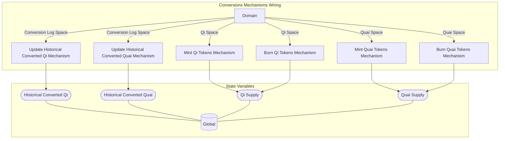

## Wiring Diagram

## Description

Block Type: Parallel Block

## Components
1. [[Mint Qi Tokens Mechanism]]
2. [[Mint Quai Tokens Mechanism]]
3. [[Burn Qi Tokens Mechanism]]
4. [[Burn Quai Tokens Mechanism]]
5. [[Update Historical Converted Qi Mechanism]]
6. [[Update Historical Converted Quai Mechanism]]

## All Blocks
1. [[Burn Qi Tokens Mechanism]]
2. [[Burn Quai Tokens Mechanism]]
3. [[Mint Qi Tokens Mechanism]]
4. [[Mint Quai Tokens Mechanism]]
5. [[Update Historical Converted Qi Mechanism]]
6. [[Update Historical Converted Quai Mechanism]]

## Constraints

## Domain Spaces
1. [[Qi Space]]
2. [[Quai Space]]
3. [[Qi Space]]
4. [[Quai Space]]
5. [[Conversion Log Space]]
6. [[Conversion Log Space]]

## Codomain Spaces
1. [[Empty Space]]

## All Spaces Used
1. [[Conversion Log Space]]
2. [[Empty Space]]
3. [[Qi Space]]
4. [[Quai Space]]
5. [[Terminating Space]]

## Parameters Used

## Called By

## Calls

## All State Updates
1. [[Global]].[[Global State-Historical Converted Qi|Historical Converted Qi]]
2. [[Global]].[[Global State-Historical Converted Quai|Historical Converted Quai]]
3. [[Global]].[[Global State-Qi Supply|Qi Supply]]
4. [[Global]].[[Global State-Quai Supply|Quai Supply]]

