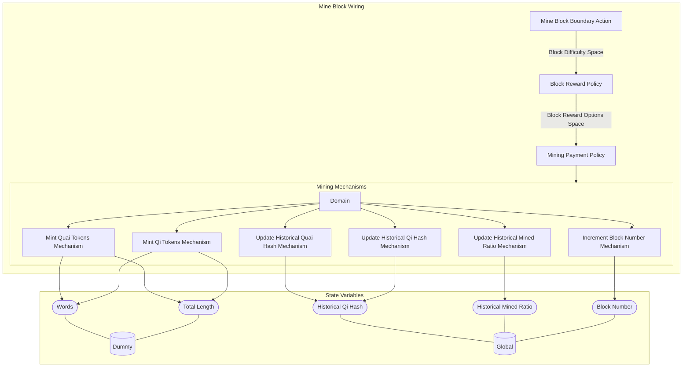

## Wiring Diagram

## Description

Block Type: Stack Block
The wiring for mining a block
## Components
1. [[Mine Block Boundary Action]]
2. [[Block Reward Policy]]
3. [[Mining Payment Policy]]
4. [[Mining Mechanisms]]

## All Blocks
1. [[Block Reward Policy]]
2. [[Increment Block Number Mechanism]]
3. [[Mine Block Boundary Action]]
4. [[Mining Payment Policy]]
5. [[Mint Qi Tokens Mechanism]]
6. [[Mint Quai Tokens Mechanism]]
7. [[Update Historical Mined Ratio Mechanism]]
8. [[Update Historical Qi Hash Mechanism]]
9. [[Update Historical Quai Hash Mechanism]]

## Constraints

## Domain Spaces

## Codomain Spaces
1. [[Empty Space]]

## All Spaces Used
1. [[Block Difficulty Space]]
2. [[Block Reward Options Space]]
3. [[Empty Space]]
4. [[Terminating Space]]

## Parameters Used

## Called By

## Calls

## All State Updates
1. [[Dummy]].[[Dummy State-Total Length|Total Length]]
2. [[Dummy]].[[Dummy State-Words|Words]]
3. [[Global]].[[Global State-Block Number|Block Number]]
4. [[Global]].[[Global State-Historical Mined Ratio|Historical Mined Ratio]]
5. [[Global]].[[Global State-Historical Qi Hash|Historical Qi Hash]]

