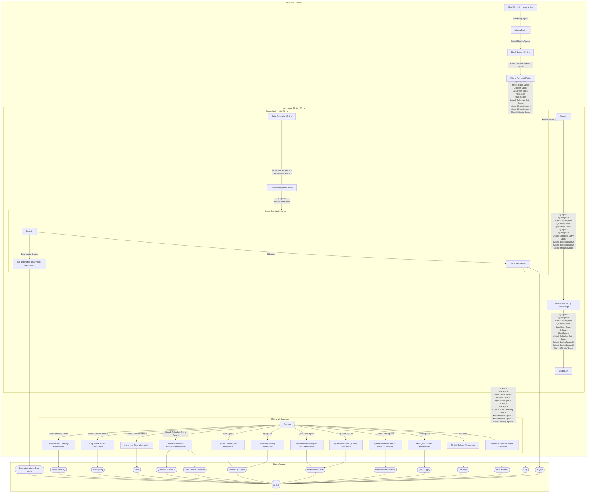

## Wiring Diagram

## Description

Block Type: Stack Block
"The wiring for mining a block.

For the decision between Qi and Quai, the idea is that there should be a Schelling point, if the miner is mining and Qi is an option, they will only look at Qi as making sense if the market price is above their production price.

If the demand for Qi is greater than the supply, there should be a profitable opportunity until market price approaches at which point amount of Qi is at equilibrium because the market price matches the production price.
## Components
1. [[Mine Block Boundary Action]]
2. [[Mining Policy]]
3. [[Block Reward Policy]]
4. [[Mining Payment Policy]]
5. [[Mezzanine Mining Wiring]]
6. [[Mining Mechanisms]]

## All Blocks
1. [[Append to Unlock Schedule Mechanism]]
2. [[Beta Estimation Policy]]
3. [[Block Reward Policy]]
4. [[Controller Update Policy]]
5. [[Increment Block Number Mechanism]]
6. [[Increment Time Mechanism]]
7. [[Log Mined Blocks Mechanism]]
8. [[Mezzanine Wiring Passthrough]]
9. [[Mine Block Boundary Action]]
10. [[Mining Payment Policy]]
11. [[Mining Policy]]
12. [[Mint Qi Tokens Mechanism]]
13. [[Mint Quai Tokens Mechanism]]
14. [[Set Estimated Beta Vector Mechanism]]
15. [[Set K Mechanism]]
16. [[Update Block Difficulty Mechanism]]
17. [[Update Historical Mined Ratio Mechanism]]
18. [[Update Historical Qi Hash Mechanism]]
19. [[Update Historical Quai Hash Mechanism]]
20. [[Update Locked Qi Mechanism]]
21. [[Update Locked Quai Mechanism]]

## Constraints

## Domain Spaces
1. [[Empty Space]]

## Codomain Spaces
1. [[Empty Space]]

## All Spaces Used
1. [[Beta Vector Space]]
2. [[Block Difficulty Space]]
3. [[Block Reward Options Space]]
4. [[Empty Space]]
5. [[K Space]]
6. [[Mined Blocks Space]]
7. [[Mined Blocks Space 2]]
8. [[Mined Ratio Space]]
9. [[Pre-Mining Space]]
10. [[Qi Hash Space]]
11. [[Qi Space]]
12. [[Quai Hash Space]]
13. [[Quai Space]]
14. [[Terminating Space]]
15. [[Unlock Schedule Entry Space]]

## Parameters Used
1. [[Aggregate Hashpower Series]]
2. [[Controller Alpha Parameter]]
3. [[Difficulty Adjustment Period]]
4. [[Difficulty Randomness Mu]]
5. [[Difficulty Randomness Sigma]]
6. [[Initial Block Difficulty]]
7. [[PID Parameterization]]
8. [[Quai Reward Base Parameter]]
9. [[State Update Skipping Parameter]]

## Called By

## Calls

## All State Updates
1. [[Global]].[[Global State-Block Difficulty|Block Difficulty]]
2. [[Global]].[[Global State-Block Number|Block Number]]
3. [[Global]].[[Global State-Estimated Mining Beta Vector|Estimated Mining Beta Vector]]
4. [[Global]].[[Global State-Historical Mined Ratio|Historical Mined Ratio]]
5. [[Global]].[[Global State-Historical Qi Hash|Historical Qi Hash]]
6. [[Global]].[[Global State-K Qi|K Qi]]
7. [[Global]].[[Global State-K Quai|K Quai]]
8. [[Global]].[[Global State-Locked Qi Supply|Locked Qi Supply]]
9. [[Global]].[[Global State-Mining Log|Mining Log]]
10. [[Global]].[[Global State-Qi Supply|Qi Supply]]
11. [[Global]].[[Global State-Qi Unlock Schedule|Qi Unlock Schedule]]
12. [[Global]].[[Global State-Quai Supply|Quai Supply]]
13. [[Global]].[[Global State-Quai Unlock Schedule|Quai Unlock Schedule]]
14. [[Global]].[[Global State-Time|Time]]

