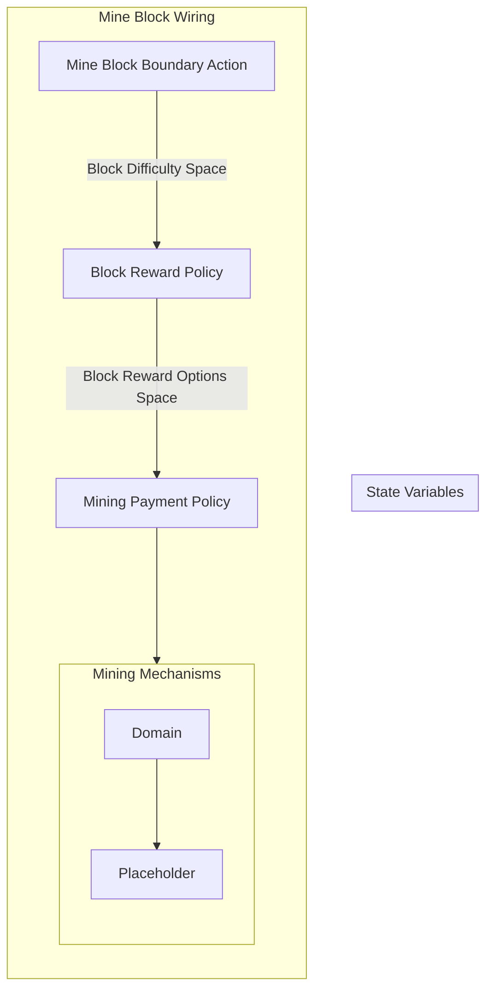

## Wiring Diagram

## Description

Block Type: Stack Block
The wiring for mining a block
## Components
1. [[Mine Block Boundary Action]]
2. [[Block Reward Policy]]
3. [[Mining Payment Policy]]
4. [[Mining Mechanisms]]

## All Blocks
1. [[Block Reward Policy]]
2. [[Mine Block Boundary Action]]
3. [[Mining Payment Policy]]
4. [[Placeholder]]

## Constraints

## Domain Spaces

## Codomain Spaces
1. [[Empty Space]]

## All Spaces Used
1. [[Block Difficulty Space]]
2. [[Block Reward Options Space]]
3. [[Empty Space]]

## Parameters Used

## Called By

## Calls

## All State Updates

