## Wiring Diagram

```mermaid
graph TB

subgraph SVS["State Variables"]
EE0[("Global")]
EES0(["Aggregate Hashpower"])
EES0 --- EE0
EES1(["Block Difficulty"])
EES1 --- EE0
EES2(["Block Number"])
EES2 --- EE0
EES3(["Historical Mined Ratio"])
EES3 --- EE0
EES4(["Historical Qi Hash"])
EES4 --- EE0
EES5(["Locked Qi Supply"])
EES5 --- EE0
EES6(["Mining Log"])
EES6 --- EE0
EES7(["Qi Supply"])
EES7 --- EE0
EES8(["Qi Unlock Schedule"])
EES8 --- EE0
EES9(["Quai Supply"])
EES9 --- EE0
EES10(["Quai Unlock Schedule"])
EES10 --- EE0
EES11(["Time"])
EES11 --- EE0
end

subgraph X16["Mining Mechanisms"]
direction TB
X1["Increment Block Number Mechanism"]
X1 --> EES2
X2["Mint Qi Tokens Mechanism"]
X2 --> EES7
X3["Mint Quai Tokens Mechanism"]
X3 --> EES9
X4["Update Historical Mined Ratio Mechanism"]
X4 --> EES3
X5["Update Historical Qi Hash Mechanism"]
X5 --> EES4
X6["Update Historical Quai Hash Mechanism"]
X6 --> EES4
X7["Update Locked Qi Mechanism"]
X7 --> EES5
X8["Update Locked Quai Mechanism"]
X8 --> EES5
X9["Append to Unlock Schedule Mechanism"]
X9 --> EES10
X9 --> EES8
X10["Increment Time Mechanism"]
X10 --> EES11
X11["Log Mined Blocks Mechanism"]
X11 --> EES6
X12["Update Hash Rate Mechanism"]
X12 --> EES0
X13["Update Block Difficulty Mechanism"]
X13 --> EES1
X14[Domain]

direction LR
direction TB
X14 --> X1
X14 --"Qi Space"--> X2
X14 --"Quai Space"--> X3
X14 --"Mined Ratio Space"--> X4
X14 --"Qi Hash Space"--> X5
X14 --"Quai Hash Space"--> X6
X14 --"Qi Space"--> X7
X14 --"Quai Space"--> X8
X14 --"Unlock Schedule Entry Space"--> X9
X14 --"Mined Blocks Space 2"--> X10
X14 --"Mined Blocks Space 2"--> X11
X14 --> X12
X14 --"Block Difficulty Space"--> X13
end
```

## Description

Block Type: Parallel Block
The mechanisms associated with mining a block
## Components
1. [[Increment Block Number Mechanism]]
2. [[Mint Qi Tokens Mechanism]]
3. [[Mint Quai Tokens Mechanism]]
4. [[Update Historical Mined Ratio Mechanism]]
5. [[Update Historical Qi Hash Mechanism]]
6. [[Update Historical Quai Hash Mechanism]]
7. [[Update Locked Qi Mechanism]]
8. [[Update Locked Quai Mechanism]]
9. [[Append to Unlock Schedule Mechanism]]
10. [[Increment Time Mechanism]]
11. [[Log Mined Blocks Mechanism]]
12. [[Update Hash Rate Mechanism]]
13. [[Update Block Difficulty Mechanism]]

## All Blocks
1. [[Append to Unlock Schedule Mechanism]]
2. [[Increment Block Number Mechanism]]
3. [[Increment Time Mechanism]]
4. [[Log Mined Blocks Mechanism]]
5. [[Mint Qi Tokens Mechanism]]
6. [[Mint Quai Tokens Mechanism]]
7. [[Update Block Difficulty Mechanism]]
8. [[Update Hash Rate Mechanism]]
9. [[Update Historical Mined Ratio Mechanism]]
10. [[Update Historical Qi Hash Mechanism]]
11. [[Update Historical Quai Hash Mechanism]]
12. [[Update Locked Qi Mechanism]]
13. [[Update Locked Quai Mechanism]]

## Constraints

## Domain Spaces
1. [[Qi Space]]
2. [[Quai Space]]
3. [[Mined Ratio Space]]
4. [[Qi Hash Space]]
5. [[Quai Hash Space]]
6. [[Qi Space]]
7. [[Quai Space]]
8. [[Unlock Schedule Entry Space]]
9. [[Mined Blocks Space 2]]
10. [[Mined Blocks Space 2]]
11. [[Block Difficulty Space]]

## Codomain Spaces
1. [[Empty Space]]

## All Spaces Used
1. [[Block Difficulty Space]]
2. [[Empty Space]]
3. [[Mined Blocks Space 2]]
4. [[Mined Ratio Space]]
5. [[Qi Hash Space]]
6. [[Qi Space]]
7. [[Quai Hash Space]]
8. [[Quai Space]]
9. [[Terminating Space]]
10. [[Unlock Schedule Entry Space]]

## Parameters Used
1. [[Difficulty Adjustment Period]]
2. [[State Update Skipping Parameter]]

## Called By

## Calls

## All State Updates
1. [[Global]].[[Global State-Aggregate Hashpower|Aggregate Hashpower]]
2. [[Global]].[[Global State-Block Difficulty|Block Difficulty]]
3. [[Global]].[[Global State-Block Number|Block Number]]
4. [[Global]].[[Global State-Historical Mined Ratio|Historical Mined Ratio]]
5. [[Global]].[[Global State-Historical Qi Hash|Historical Qi Hash]]
6. [[Global]].[[Global State-Locked Qi Supply|Locked Qi Supply]]
7. [[Global]].[[Global State-Mining Log|Mining Log]]
8. [[Global]].[[Global State-Qi Supply|Qi Supply]]
9. [[Global]].[[Global State-Qi Unlock Schedule|Qi Unlock Schedule]]
10. [[Global]].[[Global State-Quai Supply|Quai Supply]]
11. [[Global]].[[Global State-Quai Unlock Schedule|Quai Unlock Schedule]]
12. [[Global]].[[Global State-Time|Time]]

