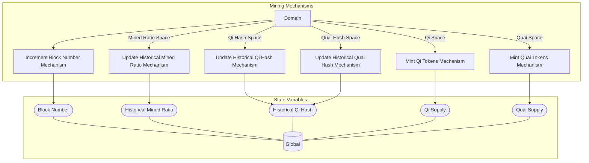

## Wiring Diagram

## Description

Block Type: Parallel Block
The mechanisms associated with mining a block
## Components
1. [[Increment Block Number Mechanism]]
2. [[Mint Qi Tokens Mechanism]]
3. [[Mint Quai Tokens Mechanism]]
4. [[Update Historical Mined Ratio Mechanism]]
5. [[Update Historical Qi Hash Mechanism]]
6. [[Update Historical Quai Hash Mechanism]]

## All Blocks
1. [[Increment Block Number Mechanism]]
2. [[Mint Qi Tokens Mechanism]]
3. [[Mint Quai Tokens Mechanism]]
4. [[Update Historical Mined Ratio Mechanism]]
5. [[Update Historical Qi Hash Mechanism]]
6. [[Update Historical Quai Hash Mechanism]]

## Constraints

## Domain Spaces
1. [[Qi Space]]
2. [[Quai Space]]
3. [[Mined Ratio Space]]
4. [[Qi Hash Space]]
5. [[Quai Hash Space]]

## Codomain Spaces
1. [[Empty Space]]

## All Spaces Used
1. [[Empty Space]]
2. [[Mined Ratio Space]]
3. [[Qi Hash Space]]
4. [[Qi Space]]
5. [[Quai Hash Space]]
6. [[Quai Space]]
7. [[Terminating Space]]

## Parameters Used

## Called By

## Calls

## All State Updates
1. [[Global]].[[Global State-Block Number|Block Number]]
2. [[Global]].[[Global State-Historical Mined Ratio|Historical Mined Ratio]]
3. [[Global]].[[Global State-Historical Qi Hash|Historical Qi Hash]]
4. [[Global]].[[Global State-Qi Supply|Qi Supply]]
5. [[Global]].[[Global State-Quai Supply|Quai Supply]]

