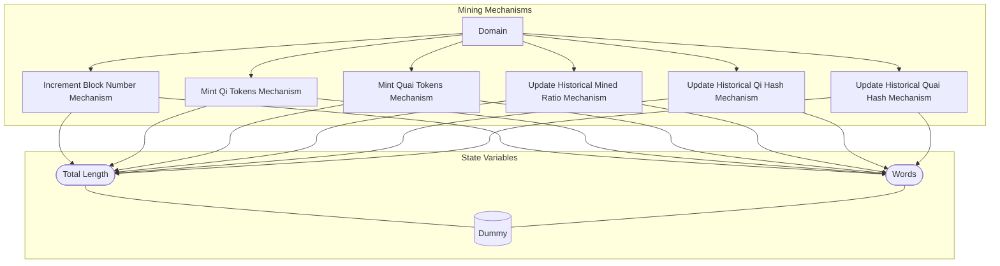

## Wiring Diagram

## Description

Block Type: Parallel Block
The mechanisms associated with mining a block
## Components
1. [[Increment Block Number Mechanism]]
2. [[Mint Qi Tokens Mechanism]]
3. [[Mint Quai Tokens Mechanism]]
4. [[Update Historical Mined Ratio Mechanism]]
5. [[Update Historical Qi Hash Mechanism]]
6. [[Update Historical Quai Hash Mechanism]]

## All Blocks
1. [[Increment Block Number Mechanism]]
2. [[Mint Qi Tokens Mechanism]]
3. [[Mint Quai Tokens Mechanism]]
4. [[Update Historical Mined Ratio Mechanism]]
5. [[Update Historical Qi Hash Mechanism]]
6. [[Update Historical Quai Hash Mechanism]]

## Constraints

## Domain Spaces
1. [[Empty Space]]

## Codomain Spaces
1. [[Empty Space]]

## All Spaces Used
1. [[Empty Space]]
2. [[Terminating Space]]

## Parameters Used

## Called By

## Calls

## All State Updates
1. [[Dummy]].[[Dummy State-Total Length|Total Length]]
2. [[Dummy]].[[Dummy State-Words|Words]]

