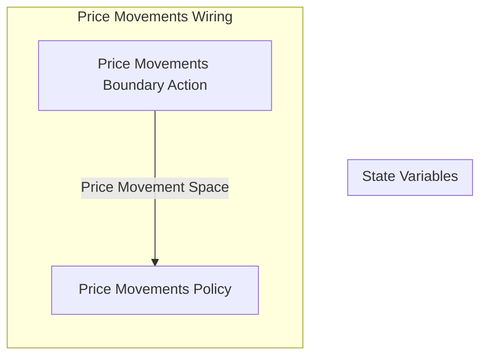

## Wiring Diagram

## Description

Block Type: Stack Block
The wiring for movements on the price of Qi and Quai
## Components
1. [[Price Movements Boundary Action]]
2. [[Price Movements Policy]]

## All Blocks
1. [[Price Movements Boundary Action]]
2. [[Price Movements Policy]]

## Constraints

## Domain Spaces

## Codomain Spaces
1. [[Empty Space]]

## All Spaces Used
1. [[Empty Space]]
2. [[Price Movement Space]]

## Parameters Used
1. [[Asset Return Parameterization]]

## Called By

## Calls

## All State Updates

