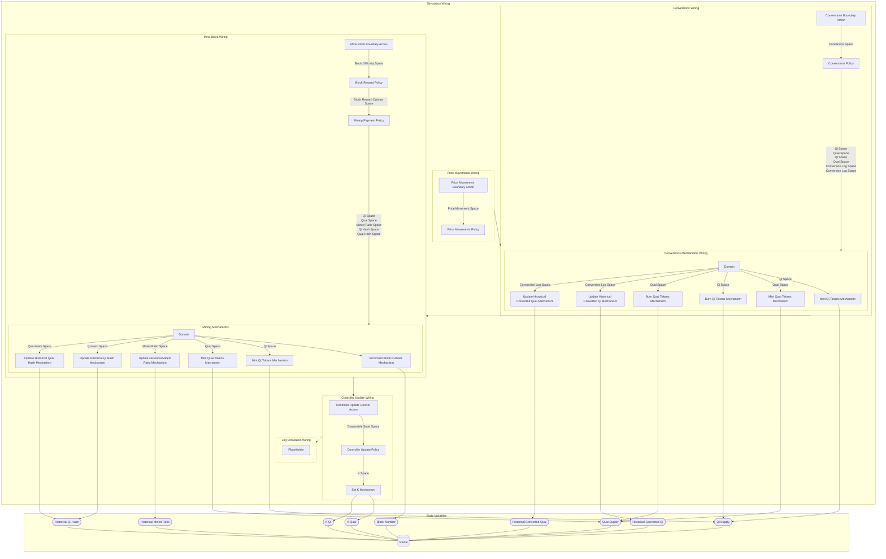

## Wiring Diagram

## Description

Block Type: Stack Block
The wiring of the entire simulation
## Components
1. [[Price Movements Wiring]]
2. [[Conversions Wiring]]
3. [[Mine Block Wiring]]
4. [[Controller Update Wiring]]
5. [[Log Simulation Wiring]]

## All Blocks
1. [[Block Reward Policy]]
2. [[Burn Qi Tokens Mechanism]]
3. [[Burn Quai Tokens Mechanism]]
4. [[Controller Update Control Action]]
5. [[Controller Update Policy]]
6. [[Conversions Boundary Action]]
7. [[Conversions Policy]]
8. [[Increment Block Number Mechanism]]
9. [[Mine Block Boundary Action]]
10. [[Mining Payment Policy]]
11. [[Mint Qi Tokens Mechanism]]
12. [[Mint Quai Tokens Mechanism]]
13. [[Placeholder]]
14. [[Price Movements Boundary Action]]
15. [[Price Movements Policy]]
16. [[Set K Mechanism]]
17. [[Update Historical Converted Qi Mechanism]]
18. [[Update Historical Converted Quai Mechanism]]
19. [[Update Historical Mined Ratio Mechanism]]
20. [[Update Historical Qi Hash Mechanism]]
21. [[Update Historical Quai Hash Mechanism]]

## Constraints

## Domain Spaces

## Codomain Spaces
1. [[Empty Space]]

## All Spaces Used
1. [[Block Difficulty Space]]
2. [[Block Reward Options Space]]
3. [[Conversion Log Space]]
4. [[Conversion Space]]
5. [[Empty Space]]
6. [[K Space]]
7. [[Mined Ratio Space]]
8. [[Observable State Space]]
9. [[Price Movement Space]]
10. [[Qi Hash Space]]
11. [[Qi Space]]
12. [[Quai Hash Space]]
13. [[Quai Space]]
14. [[Terminating Space]]

## Parameters Used
1. [[Asset Return Parameterization]]
2. [[Initial Block Difficulty]]
3. [[Minimum Qi Conversion Amount]]
4. [[Minimum Quai Conversion Amount]]
5. [[PID Parameterization]]

## Called By

## Calls

## All State Updates
1. [[Global]].[[Global State-Block Number|Block Number]]
2. [[Global]].[[Global State-Historical Converted Qi|Historical Converted Qi]]
3. [[Global]].[[Global State-Historical Converted Quai|Historical Converted Quai]]
4. [[Global]].[[Global State-Historical Mined Ratio|Historical Mined Ratio]]
5. [[Global]].[[Global State-Historical Qi Hash|Historical Qi Hash]]
6. [[Global]].[[Global State-K Qi|K Qi]]
7. [[Global]].[[Global State-K Quai|K Quai]]
8. [[Global]].[[Global State-Qi Supply|Qi Supply]]
9. [[Global]].[[Global State-Quai Supply|Quai Supply]]

