## Wiring Diagram

```mermaid
graph TB

subgraph SVS["State Variables"]
EE0[("Global")]
EES0(["Block Difficulty"])
EES0 --- EE0
EES1(["Block Number"])
EES1 --- EE0
EES2(["Estimated Mining Beta Vector"])
EES2 --- EE0
EES3(["Historical Converted Qi"])
EES3 --- EE0
EES4(["Historical Converted Quai"])
EES4 --- EE0
EES5(["Historical Mined Ratio"])
EES5 --- EE0
EES6(["Historical Qi Hash"])
EES6 --- EE0
EES7(["K Qi"])
EES7 --- EE0
EES8(["K Quai"])
EES8 --- EE0
EES9(["Locked Qi Supply"])
EES9 --- EE0
EES10(["Locked Quai Supply"])
EES10 --- EE0
EES11(["Mining Log"])
EES11 --- EE0
EES12(["Population Mining Beta Vector"])
EES12 --- EE0
EES13(["Qi Price"])
EES13 --- EE0
EES14(["Qi Supply"])
EES14 --- EE0
EES15(["Qi Unlock Schedule"])
EES15 --- EE0
EES16(["Quai Price"])
EES16 --- EE0
EES17(["Quai Supply"])
EES17 --- EE0
EES18(["Quai Unlock Schedule"])
EES18 --- EE0
EES19(["Simulation History Log"])
EES19 --- EE0
EES20(["Time"])
EES20 --- EE0
end

subgraph X66["Simulation Wiring"]
direction TB
subgraph X4["Price Movements Wiring"]
direction TB
X1["Price Movements Boundary Action"]
X2["Price Movements Policy"]
X3["Update Prices Mechanism"]
X3 --> EES16
X3 --> EES13
X1--"Price Movement Space"--->X2
X2--"Price Space"--->X3
end
subgraph X19["Conversions Wiring"]
direction TB
X5["Conversions Boundary Action"]
X6["Conversions Policy"]
subgraph X18["Conversions Mechanisms Wiring"]
direction TB
X7["Mint Qi Tokens Mechanism"]
X7 --> EES14
X8["Mint Quai Tokens Mechanism"]
X8 --> EES17
X9["Burn Qi Tokens Mechanism"]
X9 --> EES14
X10["Burn Quai Tokens Mechanism"]
X10 --> EES17
X11["Update Historical Converted Qi Mechanism"]
X11 --> EES3
X12["Update Historical Converted Quai Mechanism"]
X12 --> EES4
X13["Update Locked Qi Mechanism"]
X13 --> EES9
X14["Update Locked Quai Mechanism"]
X14 --> EES9
X15["Append to Unlock Schedule Mechanism"]
X15 --> EES18
X15 --> EES15
X16[Domain]

direction LR
direction TB
X16 --"Qi Space"--> X7
X16 --"Quai Space"--> X8
X16 --"Qi Space"--> X9
X16 --"Quai Space"--> X10
X16 --"Conversion Log Space"--> X11
X16 --"Conversion Log Space"--> X12
X16 --"Qi Space"--> X13
X16 --"Quai Space"--> X14
X16 --"Unlock Schedule Entry Space"--> X15
end
X5--"Conversion Space"--->X6
X6--"Qi Space
Quai Space
Qi Space
Quai Space
Conversion Log Space
Conversion Log Space
Qi Space
Quai Space
Unlock Schedule Entry Space"----------->X18
end
subgraph X51["Mine Block Wiring"]
direction TB
X20["Mine Block Boundary Action"]
X21["Mining Policy"]
X22["Block Reward Policy"]
X23["Mining Payment Policy"]
subgraph X35["Mezzanine Mining Wiring"]
direction TB
subgraph X31["Controller Update Wiring"]
direction TB
X24["Beta Estimation Policy"]
X25["Controller Update Policy"]
subgraph X30["Controller Mechanisms"]
direction TB
X26["Set K Mechanism"]
X26 --> EES8
X26 --> EES7
X27["Set Estimated Beta Vector Mechanism"]
X27 --> EES2
X28[Domain]

direction LR
direction TB
X28 --"K Space"--> X26
X28 --"Beta Vector Space"--> X27
end
X24--"Mined Blocks Space 2
Beta Vector Space"---->X25
X25--"K Space
Beta Vector Space"---->X30
end
X32["Mezzanine Wiring Passthrough"]
X33[Domain]
X34[Codomain]
direction LR
direction TB
X33 --"Mined Blocks Space 2"--> X31
X33 --"Qi Space
Quai Space
Mined Ratio Space
Qi Hash Space
Quai Hash Space
Qi Space
Quai Space
Unlock Schedule Entry Space
Mined Blocks Space 2
Mined Blocks Space 2
Block Difficulty Space"------------> X32
X32 --"Qi Space
Quai Space
Mined Ratio Space
Qi Hash Space
Quai Hash Space
Qi Space
Quai Space
Unlock Schedule Entry Space
Mined Blocks Space 2
Mined Blocks Space 2
Block Difficulty Space"--> X34
end
subgraph X50["Mining Mechanisms"]
direction TB
X36["Increment Block Number Mechanism"]
X36 --> EES1
X37["Mint Qi Tokens Mechanism"]
X37 --> EES14
X38["Mint Quai Tokens Mechanism"]
X38 --> EES17
X39["Update Historical Mined Ratio Mechanism"]
X39 --> EES5
X40["Update Historical Qi Hash Mechanism"]
X40 --> EES6
X41["Update Historical Quai Hash Mechanism"]
X41 --> EES6
X42["Update Locked Qi Mechanism"]
X42 --> EES9
X43["Update Locked Quai Mechanism"]
X43 --> EES9
X44["Append to Unlock Schedule Mechanism"]
X44 --> EES18
X44 --> EES15
X45["Increment Time Mechanism"]
X45 --> EES20
X46["Log Mined Blocks Mechanism"]
X46 --> EES11
X47["Update Block Difficulty Mechanism"]
X47 --> EES0
X48[Domain]

direction LR
direction TB
X48 --> X36
X48 --"Qi Space"--> X37
X48 --"Quai Space"--> X38
X48 --"Mined Ratio Space"--> X39
X48 --"Qi Hash Space"--> X40
X48 --"Quai Hash Space"--> X41
X48 --"Qi Space"--> X42
X48 --"Quai Space"--> X43
X48 --"Unlock Schedule Entry Space"--> X44
X48 --"Mined Blocks Space 2"--> X45
X48 --"Mined Blocks Space 2"--> X46
X48 --"Block Difficulty Space"--> X47
end
X20--"Pre-Mining Space"--->X21
X21--"Mined Blocks Space"--->X22
X22--"Block Reward Options Space"--->X23
X23--"Mined Blocks Space 2
Qi Space
Quai Space
Mined Ratio Space
Qi Hash Space
Quai Hash Space
Qi Space
Quai Space
Unlock Schedule Entry Space
Mined Blocks Space 2
Mined Blocks Space 2
Block Difficulty Space"-------------->X35
X35--"Qi Space
Quai Space
Mined Ratio Space
Qi Hash Space
Quai Hash Space
Qi Space
Quai Space
Unlock Schedule Entry Space
Mined Blocks Space 2
Mined Blocks Space 2
Block Difficulty Space"------------->X50
end
subgraph X55["Unlock Tokens Wiring"]
direction TB
X52["Unlock Tokens Control Action"]
X53["Unlock Tokens Policy"]
X54["Unlock Tokens Mechanism"]
X54 --> EES10
X54 --> EES9
X54 --> EES18
X54 --> EES15
X52--->X53
X53--"Unlock Tokens Space"--->X54
end
subgraph X59["Update Population Beta Wiring"]
direction TB
X56["Update Population Beta Boundary Action"]
X57["Update Population Beta Policy"]
X58["Update Population Beta Mechanism"]
X58 --> EES12
X56--"Beta Vector Space"--->X57
X57--"Beta Vector Space"--->X58
end
X60["Log Simulation Data Mechanism"]
X60 --> EES19
subgraph X65["DO NOT USE Unlock Tokens Wiring"]
direction TB
X61["Unlock Tokens Control Action"]
X62["Unlock Tokens Policy"]
X63["Unlock Tokens Mechanism"]
X63 --> EES10
X63 --> EES9
X63 --> EES18
X63 --> EES15
X64["DO NOT USE Print Hello Boundary Action"]
X61--->X62
X62--"Unlock Tokens Space"--->X63
X63--->X64
end
X4--->X19
X19--->X51
X51--->X55
X55--->X59
X59--->X60
X60--->X65
end
```

## Description

Block Type: Stack Block
The wiring of the entire simulation
## Components
1. [[Price Movements Wiring]]
2. [[Conversions Wiring]]
3. [[Mine Block Wiring]]
4. [[Unlock Tokens Wiring]]
5. [[Update Population Beta Wiring]]
6. [[Log Simulation Data Mechanism]]
7. [[DO NOT USE Unlock Tokens Wiring]]

## All Blocks
1. [[Append to Unlock Schedule Mechanism]]
2. [[Beta Estimation Policy]]
3. [[Block Reward Policy]]
4. [[Burn Qi Tokens Mechanism]]
5. [[Burn Quai Tokens Mechanism]]
6. [[Controller Update Policy]]
7. [[Conversions Boundary Action]]
8. [[Conversions Policy]]
9. [[DO NOT USE Print Hello Boundary Action]]
10. [[Increment Block Number Mechanism]]
11. [[Increment Time Mechanism]]
12. [[Log Mined Blocks Mechanism]]
13. [[Log Simulation Data Mechanism]]
14. [[Mezzanine Wiring Passthrough]]
15. [[Mine Block Boundary Action]]
16. [[Mining Payment Policy]]
17. [[Mining Policy]]
18. [[Mint Qi Tokens Mechanism]]
19. [[Mint Quai Tokens Mechanism]]
20. [[Price Movements Boundary Action]]
21. [[Price Movements Policy]]
22. [[Set Estimated Beta Vector Mechanism]]
23. [[Set K Mechanism]]
24. [[Unlock Tokens Control Action]]
25. [[Unlock Tokens Mechanism]]
26. [[Unlock Tokens Policy]]
27. [[Update Block Difficulty Mechanism]]
28. [[Update Historical Converted Qi Mechanism]]
29. [[Update Historical Converted Quai Mechanism]]
30. [[Update Historical Mined Ratio Mechanism]]
31. [[Update Historical Qi Hash Mechanism]]
32. [[Update Historical Quai Hash Mechanism]]
33. [[Update Locked Qi Mechanism]]
34. [[Update Locked Quai Mechanism]]
35. [[Update Population Beta Boundary Action]]
36. [[Update Population Beta Mechanism]]
37. [[Update Population Beta Policy]]
38. [[Update Prices Mechanism]]

## Constraints

## Domain Spaces
1. [[Empty Space]]

## Codomain Spaces
1. [[Empty Space]]

## All Spaces Used
1. [[Beta Vector Space]]
2. [[Block Difficulty Space]]
3. [[Block Reward Options Space]]
4. [[Conversion Log Space]]
5. [[Conversion Space]]
6. [[Empty Space]]
7. [[K Space]]
8. [[Mined Blocks Space]]
9. [[Mined Blocks Space 2]]
10. [[Mined Ratio Space]]
11. [[Pre-Mining Space]]
12. [[Price Movement Space]]
13. [[Price Space]]
14. [[Qi Hash Space]]
15. [[Qi Space]]
16. [[Quai Hash Space]]
17. [[Quai Space]]
18. [[Terminating Space]]
19. [[Unlock Schedule Entry Space]]
20. [[Unlock Tokens Space]]

## Parameters Used
1. [[Aggregate Hashpower Series]]
2. [[Asset Return Parameterization]]
3. [[Controller Alpha Parameter]]
4. [[Conversion Percentage Mu]]
5. [[Conversion Percentage Sigma]]
6. [[Difficulty Adjustment Period]]
7. [[Difficulty Randomness Mu]]
8. [[Difficulty Randomness Sigma]]
9. [[Hashpower Cost Series]]
10. [[Initial Block Difficulty]]
11. [[Lockup Options]]
12. [[Minimum K Qi]]
13. [[Minimum K Quai]]
14. [[Minimum Qi Conversion Amount]]
15. [[Minimum Quai Conversion Amount]]
16. [[PID Parameterization]]
17. [[Population Beta Signal]]
18. [[Price EWMA Lambda]]
19. [[Probability of Rational Miners]]
20. [[Qi Price Movemement Sigma]]
21. [[Quai Price Movemement Sigma]]
22. [[Quai Reward Base Parameter]]
23. [[Speculator Percentage]]
24. [[State Update Skipping Parameter]]

## Called By

## Calls

## All State Updates
1. [[Global]].[[Global State-Block Difficulty|Block Difficulty]]
2. [[Global]].[[Global State-Block Number|Block Number]]
3. [[Global]].[[Global State-Estimated Mining Beta Vector|Estimated Mining Beta Vector]]
4. [[Global]].[[Global State-Historical Converted Qi|Historical Converted Qi]]
5. [[Global]].[[Global State-Historical Converted Quai|Historical Converted Quai]]
6. [[Global]].[[Global State-Historical Mined Ratio|Historical Mined Ratio]]
7. [[Global]].[[Global State-Historical Qi Hash|Historical Qi Hash]]
8. [[Global]].[[Global State-K Qi|K Qi]]
9. [[Global]].[[Global State-K Quai|K Quai]]
10. [[Global]].[[Global State-Locked Qi Supply|Locked Qi Supply]]
11. [[Global]].[[Global State-Locked Quai Supply|Locked Quai Supply]]
12. [[Global]].[[Global State-Mining Log|Mining Log]]
13. [[Global]].[[Global State-Population Mining Beta Vector|Population Mining Beta Vector]]
14. [[Global]].[[Global State-Qi Price|Qi Price]]
15. [[Global]].[[Global State-Qi Supply|Qi Supply]]
16. [[Global]].[[Global State-Qi Unlock Schedule|Qi Unlock Schedule]]
17. [[Global]].[[Global State-Quai Price|Quai Price]]
18. [[Global]].[[Global State-Quai Supply|Quai Supply]]
19. [[Global]].[[Global State-Quai Unlock Schedule|Quai Unlock Schedule]]
20. [[Global]].[[Global State-Simulation History Log|Simulation History Log]]
21. [[Global]].[[Global State-Time|Time]]

